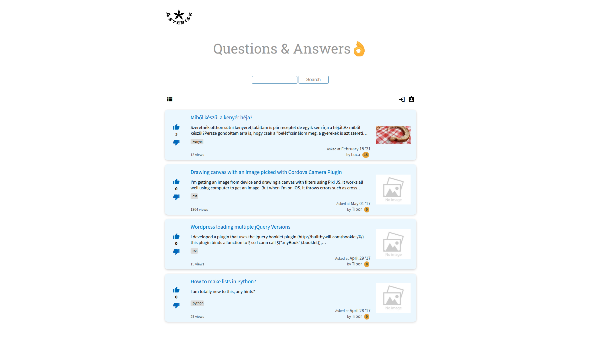
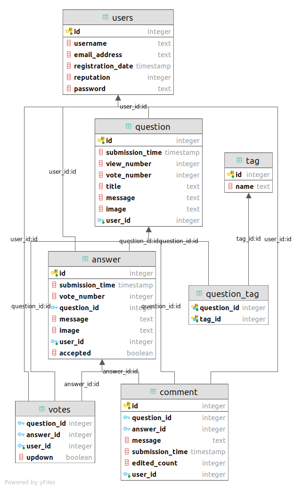

  <h1 align="center">Questions and Answers</h1>

   
  

    <a href="https://questionsandanswers.herokuapp.com/">View Demo</a>
  

   

## Introduction
Questions And Answers is a crowdsourced Q&A site, like Stack Overflow.
The site able to handle questions, answers, comments, user management, votes and storing datas in sql database. 

Features:
* Add/Edit/Delete a question
* Add/Edit/Delete a answer
* Add/Edit/Delete a comment
* Display a question
* List/Sort/Search questions
* Add image
* Add/Delete tags
* Vote on questions/answers
* User registration/login
* Bind question/answer/comment to user
* Gain/Lose reputation

## Technologies

Backend:
* Python
* Flask
* Jinja2
* SQL/PostgreSQL

Frontend:
* HTML
* CSS

## Usage

Use Heroku link:
https://questionsandanswers.herokuapp.com/

## Contact

Project Link: [https://questionsandanswers.herokuapp.com/](https://questionsandanswers.herokuapp.com/)